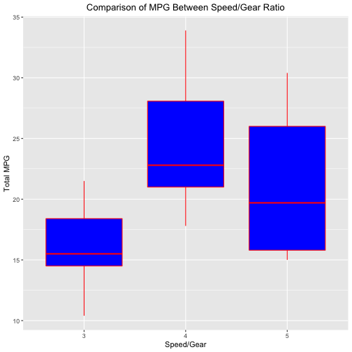

Developing Data Products
========================================================
author: H. Moore
date: 8 December 2019
autosize: true

```
        Data Reproduction Pitch Course Project
```


Overview
========================================================

You work for Motor Trend, a magazine about the automobile industry. Looking at a data set of a collection of cars, they are interested in exploring the relationship between a set of variables and miles per gallon (MPG) (outcome). They are particularly interested in the following two questions:

    1. “Is an automatic or manual transmission better for MPG”
    
    2. "Quantify the MPG difference between automatic and manual transmissions" 
    

Data Summary
========================================================
The data was extracted from the 1974 Motor Trend US magazine, and comprises fuel consumption and 10 aspects of automobile design and performance for 32 automobiles (1973–74 models). A data frame with 32 observations on 11 (numeric) variables.


```r
str(mtcars)
```

```
'data.frame':	32 obs. of  11 variables:
 $ mpg : num  21 21 22.8 21.4 18.7 18.1 14.3 24.4 22.8 19.2 ...
 $ cyl : num  6 6 4 6 8 6 8 4 4 6 ...
 $ disp: num  160 160 108 258 360 ...
 $ hp  : num  110 110 93 110 175 105 245 62 95 123 ...
 $ drat: num  3.9 3.9 3.85 3.08 3.15 2.76 3.21 3.69 3.92 3.92 ...
 $ wt  : num  2.62 2.88 2.32 3.21 3.44 ...
 $ qsec: num  16.5 17 18.6 19.4 17 ...
 $ vs  : num  0 0 1 1 0 1 0 1 1 1 ...
 $ am  : num  1 1 1 0 0 0 0 0 0 0 ...
 $ gear: num  4 4 4 3 3 3 3 4 4 4 ...
 $ carb: num  4 4 1 1 2 1 4 2 2 4 ...
```


Code Execution
========================================================
The following code execution generates a fit full regression mode on the mtcars data set to determine the MPG using all factor methods. It also determines the best fit full mode.

- Load Required Library 
- Load Data Set
- Clean Data
- Create Regression Model


```r
suppressMessages(library(ggplot2))
library(datasets)
data(mtcars)

mtcars$cyl <- factor(mtcars$cyl)
mtcars$vs <- factor(mtcars$vs)
mtcars$gear <- factor(mtcars$gear)
mtcars$carb <- factor(mtcars$carb)
mtcars$am <- factor(mtcars$am,labels=c('Automatic','Manual'))

fit.full.model <- lm(mpg ~ ., data = mtcars)
best.full.model <- step(fit.full.model, direction = "backward")
```


Graphical Illustration of Comparison and Residuals
========================================================

- A bar graph illustrating the comparison of MPG between transmissions
The bar plot indicates manual transmissions gets more miles per gallon than automatic transmisssions. 

- Residual Plots
Residual plots suggest that some transformation may be necessary to achieve linearity.




Conclusion
========================================================
The following conclusions are made based on the test results.

- Based on the test results manual transmissions are better than automatic transmissions for MPG.

- The model indicates manual transmission mpg is increased by 1.80 comparing to automatic transmissions. 

The estimate std values indicate automatic transmissions get on the average 17.1 MPG vs manual transmissions which get on the average 24.3 MPG, excluding all other factors. The t-test output confirms that this difference is statistically significant (p-value < 0.05).
